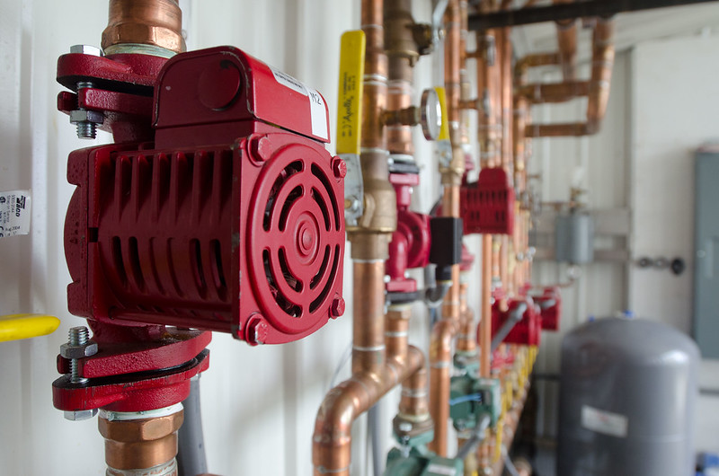
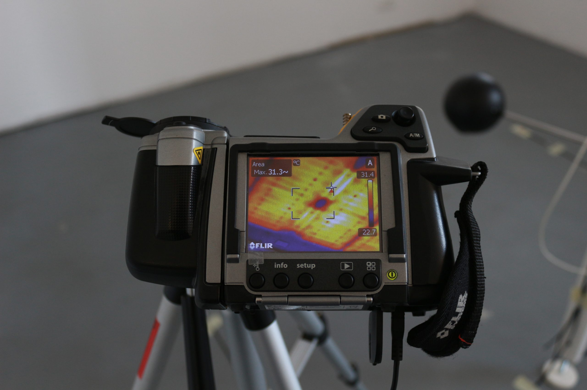

## BETALAB
Building Energy • Urban Systems • Simulation

  
  
  

---
We design, model, and analyze energy systems at building and urban scale.
Indoor Environmental Quality (IEQ)
Building Energy Performance
Urban Energy Systems
HVAC + Renewable Integration
Simulation-driven decision making

---
### 🏠 Indoor Environmental Quality
Thermal comfort
Air quality
Visual + acoustic environments
Human-centric measurements (in-situ)

---
### 🔥 Energy Efficiency in Buildings
Envelope optimization
HVAC systems modeling
Heat pumps & radiant systems
Field measurements + simulation coupling

---
### 🌆 Urban Energy Systems
District-scale modeling
Outdoor climate modeling
Energy demand aggregation
System interactions

---
### 🔊 Applied Acoustics & Sound Quality
- Environmental noise analysis
- Sound propagation in urban environments
- Indoor acoustic comfort
- Noise mitigation strategies & policies

